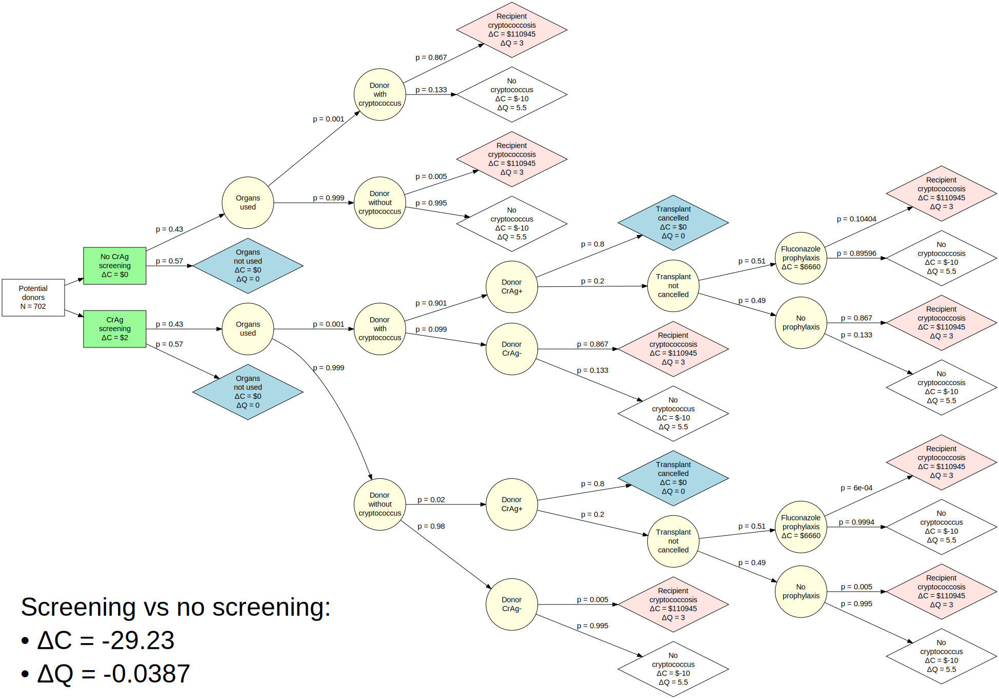

<!-- README.md is generated from README.Rmd. Please edit that file -->

```{r, include = FALSE}
knitr::opts_chunk$set(
  collapse = TRUE,
  comment = "#>"
)
```

# Cryptococcus donor screening CEA

<!-- badges: start -->
<!-- badges: end -->

The goal of Cryptococcus donor screening CEA is to perform a CEA.

## Model parameters

The parameters of the model are as below:


## Decision tree

This model leads to the following decision tree:


## Path table
The decision tree above yields the following path table:


## Summary table
The analysis above yields the following final summary table:
