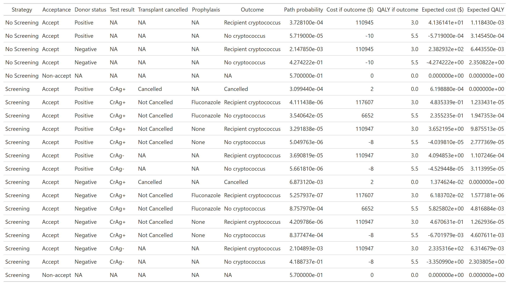
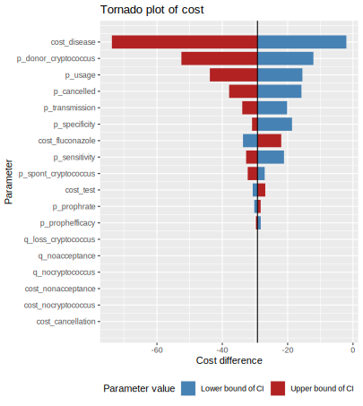
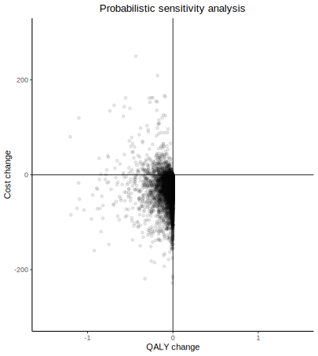

<!-- README.md is generated from README.Rmd. Please edit that file -->

# Cryptococcus donor screening CEA

<!-- badges: start -->

<!-- badges: end -->

The goal of Cryptococcus donor screening CEA is to perform a CEA. The
full analysis Github website is available at
<https://vagishhemmige.github.io/Cryptococcus-donor-screening-CEA/>

# Base case analysis

## Model parameters

The parameters of the model are as below:

## Decision tree

This model leads to the following decision tree: 

## Path table

The decision tree above yields the following path table:

<figure>

<figcaption aria-hidden="true">CrAg tree table</figcaption>
</figure>

## Summary table

The analysis above yields the following final summary table: 

# Sensitivity analyses

## Tornado diagrams

One-way sensitivity analysis yields the following tornado diagrams for
cost and QALYs:  

## Probabilistic sensitivity analysis

We perform 10,000 simulations, yielding the following results for
sensitivity analysis: 
